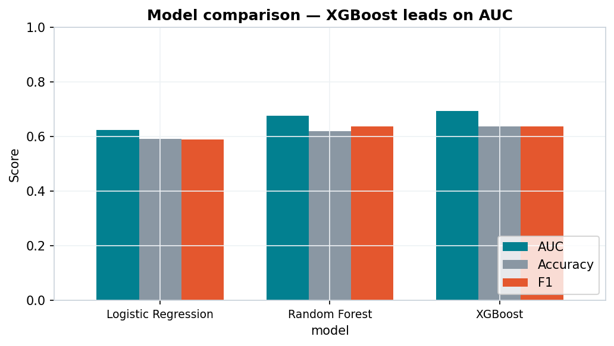
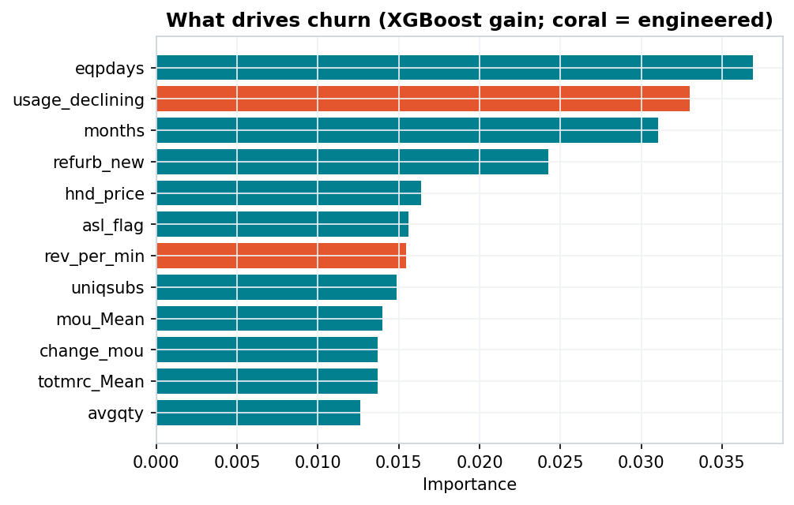
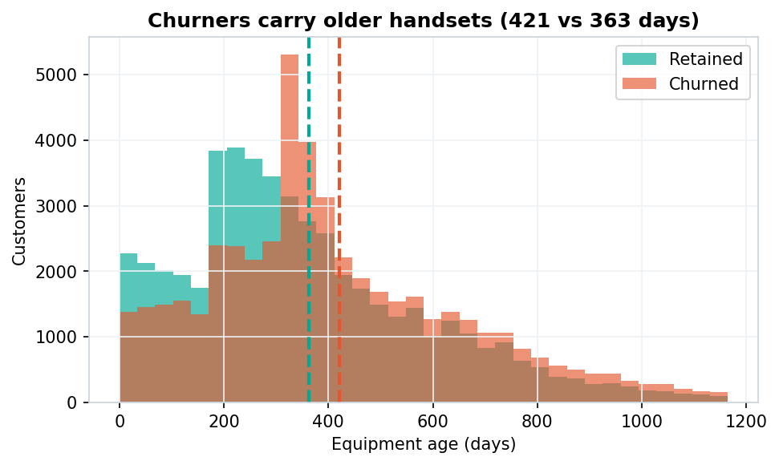
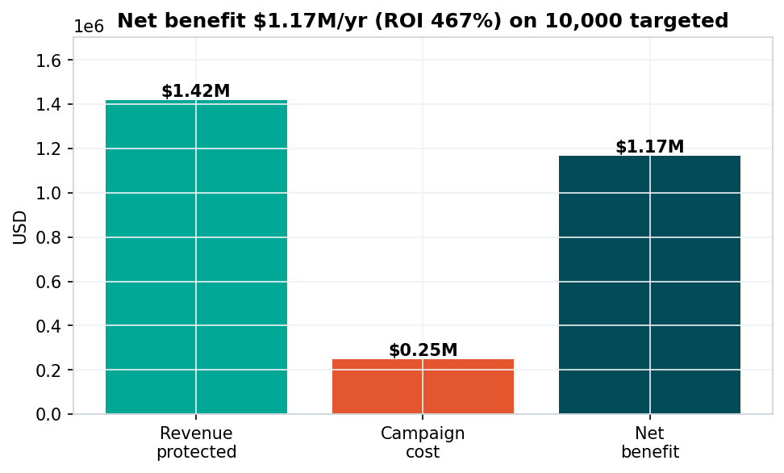

# Telecom Customer Churn — Prediction & Retention Strategy

A machine-learning project that predicts which telecom customers are about to leave and turns that prediction into a quantified, ROI-positive retention plan. Built as an end-to-end proof of concept: data → model → business case → executive presentation.

---

## Why this project

Telecom is one of the highest-churn industries in the world, with annual customer churn commonly benchmarked at 20–30%. Because winning a new customer costs roughly 5–10× more than keeping an existing one, retention is the most cost-effective growth lever a carrier has. The catch: you can only retain a customer if you spot the risk *before* they leave. This project builds that early-warning system and translates it into a concrete business decision — who to contact, what it costs, and what it returns.

## The dataset

Two tables for ~100,000 customers, joined on `Customer_ID`:

| File | Granularity | Contents |
|---|---|---|
| `Client.csv` | one row / customer | tenure, plan, equipment, demographics |
| `Record.csv` | one row / customer | monthly usage, billing, call-quality, **`churn`** |

After joining: **100,000 rows × 100 columns**. The target `churn` is roughly balanced (~50%), so the model is evaluated on **ROC-AUC** rather than raw accuracy.

> ⚠️ **The raw data is not included in this repository** (it is proprietary assignment data). The code expects the two CSVs in a local `telecom/` folder — see [Running it](#running-it).

## Approach

1. **EDA** — quantify churn balance, missingness, and the relationship between churn and key drivers (equipment age, tenure, usage trends).
2. **Feature engineering** — derive behaviour signals the raw columns don't capture:
   - `eqp_per_month` — handset age relative to tenure
   - `usage_declining` — flag for customers whose minutes are trending down
   - `care_intensity` — support calls per minute of use (a frustration proxy)
   - `rev_per_min` — revenue efficiency
   - `drop_rate` — share of attempted calls that fail (network-quality pain)
3. **Modelling** — train and compare three models (Logistic Regression, Random Forest, XGBoost) under an identical 70/30 stratified split; select the best by AUC.
4. **Evaluation** — ROC, confusion matrix, and feature importance, checked for consistency against the EDA story.
5. **Targeting & business case** — rank customers by predicted risk, take the top decile, and compute an expected-value model (revenue protected − campaign cost) with a save-rate sensitivity analysis.
6. **Reporting** — auto-generate a 15-slide executive deck from the computed metrics.

## Key results

**Model comparison (test set):**

| Model | AUC | Accuracy | Precision | Recall | F1 |
|---|---|---|---|---|---|
| Logistic Regression | 0.625 | 0.591 | 0.586 | 0.593 | 0.590 |
| Random Forest | 0.677 | 0.620 | 0.604 | 0.676 | 0.638 |
| **XGBoost (chosen)** | **0.695** | **0.637** | **0.632** | **0.642** | **0.637** |



**Top churn drivers:** equipment age (`eqpdays`), declining usage, tenure (`months`), refurbished-handset flag, handset price. Churners carry noticeably older handsets on average (421 vs 363 days) — and equipment age is something the business can *act on* via upgrade offers, making it a lever rather than just a correlate.



The exploratory analysis confirms the story: customers who churn carry older handsets on average.



**Targeting:** the top risk-decile is **78.8% churners** (1.6× lift over the base rate).

**Projected business impact** (ARPU $50, 12-month horizon, $25 offer cost, 30% save rate, top-10% targeting):

| Metric | Value |
|---|---|
| Customers targeted | 10,000 |
| Customers saved | ~2,364 |
| Revenue protected | ~$1.42M |
| Campaign cost | ~$0.25M |
| **Net benefit** | **~$1.17M / yr** |
| **Return on retention spend** | **467%** |

Net benefit stays positive across a 10–50% save-rate sensitivity range.



## Repository structure

```
telecom-churn-retention/
├── README.md
├── requirements.txt
├── LICENSE
├── notebooks/
│   └── churn_analysis.ipynb      # full analysis, runs end-to-end
├── src/
│   └── make_deck.py              # builds the 15-slide deck from metrics + figures
├── reports/
│   └── business_proposal_deck.pdf# the executive presentation (real numbers)
├── figures/                      # charts exported by the notebook
└── data/
    └── README.md                 # how to supply the (not-included) data
```

## Running it

**Requirements:** Python 3.10+ and the packages in `requirements.txt`.

```bash
pip install -r requirements.txt
```

1. Place `Client.csv` and `Record.csv` inside a `telecom/` folder next to the notebook.
2. Open `notebooks/churn_analysis.ipynb` and **Run All**. It performs the full analysis, writes `figures/` and `metrics.json`, and rebuilds the deck.

**Google Colab:** uncomment the Drive-mount cell in Section 2 and point `DATA_DIR` at the folder that holds your `telecom/` sub-folder.

## Tech stack

Python · pandas · NumPy · scikit-learn · XGBoost · Matplotlib · python-pptx

## Sources

- CustomerGauge — *Average Churn Rate by Industry (2025 B2B Benchmarks)*
- Tridens Technology — *Why Telecom Customers Churn and How to Measure It* (2025)
- BillingPlatform — *Churn Rates by Industry* (2025)

## License

Released under the MIT License — see [LICENSE](LICENSE). Note that the license covers the **code**, not the dataset, which is not distributed here.
